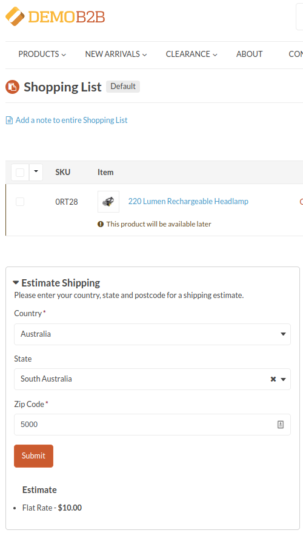

Aligent OroCommerce Shipping Estimator Bundle
==============================
This bundle adds the Shipping Estimator functionality on the OroCommerce storefront shopping list.



### Features
- Enable/disable the Shipping Estimator component on the storefront shopping list

Requirements
-------------------
- OroCommerce 4.2

Installation and Usage
-------------------
**NOTE: Adjust instructions as needed for your local environment**

### Installation
Install via Composer
```shell
composer require aligent/orocommerce-shipping-estimator
```

Once installed, run platform update to perform the installation:
```shell
php bin/console oro:platform:update --env=prod
```


### Configuration Settings


| Setting                                        | Description                                                                      |
|------------------------------------------------|----------------------------------------------------------------------------------|
| **Enable Shipping Estimator On Shopping List** | The Estimate Shipping functionality will be displayed on the Shipping List page. |

Database Modifications
-------------------
*This Bundle does not directly modify the database schema in any way*

All configuration is stored in System Configuration (`oro_config_value`).

Templates
-------------------
`Resources/views/layouts/default/oro_shopping_list_frontend_view/shipping_estimator.html.twig`

This includes a single `_shipping_estimator_container_widget` block which can be customized/overridden in OroCommerce themes
if needed.

Roadmap / Remaining Tasks
-------------------
- [ ] Ability to display the Shipping Estimator component on other routes (eg: PDP) 
- [ ] OroCommerce 5.0 Support
- [ ] Implement Unit Tests